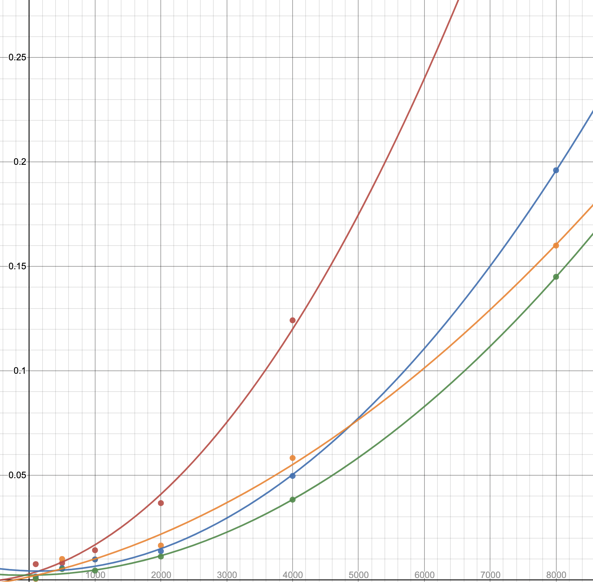

# Discussion

## PART I: MEASURED IndexedList

1. **Discuss from a design perspective whether or not iterating over a `MeasuredIndexedList` should affect the accesses and mutation counts. Note that for the purposes of this assignment we are NOT asking you to rewrite the `ArrayIndexedListIterator` to do so. However, if you wanted to include the `next()` and/or `hasNext()` methods in the statistics measured, can you inherit `ArrayIndexedListIterator` from `ArrayIndexedList` and override the relevant methods, or not? Explain.**

Iterating over a `MeasuredIndexedList` will have access to each and every element in the list, so it should add to the accesses count. 
However, iterating through the list does not modify any of the element value so mutation count is unchanged. 

We can't inherit `ArrayIndexedListIterator` from `ArrayIndexedList` because it is a private nested class inside `ArrayIndexedList`
which is only visible within the `ArrayIndexedList` class. Therefore, we do not have access to `ArrayIndexedListIterator` and thus cannot
inherit from it.

## PART II: ALL SORT OF SORTS

1. **Explain the mistake in the setup/implementation of the experiment is set up and implemented which resulted in a discrepancy between the results and what is expected from each sorting algorithm.**

`readData()` in `SortingAlgorithmDriver` stores content of data files as a list of Strings. This makes `compareTo()` 
in helper `less()` compare two Strings. But `compareTo()` compares Strings lexicographically, for example, `"10".compareTo("9") < 0`. This is not what we
intend to have after sorting.

2. **Does the actual running time correspond to the asymptotic complexity as you would expect?**

To check the time complexity of algorithms, I run each algorithm with different input size, I choose
`descending.data` because it simulates the worst-case scenario:

| Size        | 100      | 500      | 1000     | 2000     | 4000     | 8000     |
|-------------|----------|----------|----------|----------|----------|----------|
| `Gnome`     | 0.007479 | 0.008003 | 0.014151 | 0.036708 | 0.124228 | 0.400003 |
| `Selection` | 0.000595 | 0.005128 | 0.004413 | 0.011103 | 0.038343 | 0.145048 |
| `Bubble`    | 0.001571 | 0.005547 | 0.009721 | 0.013692 | 0.049715 | 0.196066 |
| `Insertion` | 0.000391 | 0.009940 | 0.009741 | 0.016389 | 0.058313 | 0.160022 |

<p align="center"></p>
The running time of each algorithm follows the O(n^2) time complexity approximately. But because 
different algorithms have different lower-power terms and constants in their actual number of 
operations, so their graphs differ from each other.

3. **What explains the practical differences between these algorithms? (Theoretically, the algorithm runs in O(X) time, where X is a function of the input size, but in practice (i.e running it on datasets), you may observe that it is slower/faster compared to the other algorithms)**

Since we are analyzing the practical differences, it is best to use `random.data` to examine their behaviours:

|   Data file   |    Algorithm     |  Sorted?  |   Accesses   |  Mutations  |  Seconds   |
|:-------------:|:----------------:|:---------:|:------------:|:-----------:|:----------:|
|  random.data  |    Gnome Sort    |   true    |  24,145,478  |  8,045,828  |  0.058825  |
|  random.data  |  Selection Sort  |   true    |  16,003,992  |    7,992    |  0.033911  |
|  random.data  |   Bubble Sort    |   true    |  24,019,776  |  8,045,828  |  0.090456  |
|  random.data  |  Insertion Sort  |   true    |  8,053,824   |  4,026,913  |  0.013148  |

This the result of size 4000. We can observe that, although these 4 algorithms all  hav
 O(n^2) time complexity, they differ rather largely when processing the same random data.
This is because in practice, the number of operations of different algorithms on the same data
vary. Here, different number of access and mutation result in the variations of processing time.
We also observe that in practice, `Bubble Sort` is significantly slower than other 3 sorting
algorithms. 

4. **Does it matter what kind of data (random, already sorted in ascending order, sorted in descending order) you are sorting? How should each algorithm behave (in terms of performance) based on the type of data it receives?**

`Selection Sort` doesn't depend on the kind of data. This is because `Selection Sort` finds the minimum element in the list
and insert it into corresponding position. When `Selection Sort` sorts `ascending.data` that is already sorted, it behaves slower than other 3 algorithms, 
since it still needs to find the minimum element for every iteration although the data is already sorted.  

When sorting ascending data, `Bubble sort` and `Insertion sort` are faster. This is because less swap will be done.

When sorting descending data, `Bubble sort` takes more time than the other two algorithms mainly because it does more swaps.
`Bubble sort` needs to swap the largest element in the list to the tail in every traverse. The total number of mutations is 2*(n(n-1)/2), which is way more 
than `Selection sort` and `Insertion sort` which only put elements into the right position.

The result aligns with my reasoning, this is the output of size 4000:

|    Data file    |   Algorithm    | Sorted? |   Accesses |  Mutations | Seconds  |
|:---------------:|:--------------:|:-------:|-----------:|-----------:|:--------:|
| ascending.data  |   Null Sort    |  false  |          0 |          0 | 0.000003 |
| ascending.data  |   Gnome Sort   |  true   | 15,230,058 |  5,074,020 | 0.061871 |
| ascending.data  | Selection Sort |  true   | 16,003,980 |      7,980 | 0.049949 |
| ascending.data  |  Bubble Sort   |  true   | 12,055,014 |  5,074,020 | 0.036392 |
| ascending.data  | Insertion Sort |  true   |  5,082,018 |  2,541,009 | 0.022698 |
|                 |                |         |            |            |          |
| descending.data |   Null Sort    |  false  |          0 |          0 | 0.000003 |
| descending.data |   Gnome Sort   |  true   | 47,988,000 | 15,996,000 | 0.101257 |
| descending.data | Selection Sort |  true   | 16,000,000 |      4,000 | 0.042060 |
| descending.data |  Bubble Sort   |  true   | 31,992,000 | 15,996,000 | 0.049719 |
| descending.data | Insertion Sort |  true   | 15,999,999 |  8,001,999 | 0.049265 |

We can observe that in sorting descending data, `Bubble sort` has much more mutations and accesses than
`Insertion sort` and `Selection sort`. Also, `Selection sort` does not differ much between different kind of data, while other 
algorithms are slower when sorting descending data than ascending data.

## PART III: ANALYSIS OF SELECTION SORT

1. **Determine exactly how many comparisons C(n) and assignments A(n) are performed by this implementation of selection sort in the worst case. Both of those should be polynomials of degree 2 since you know that the asymptotic complexity of selection sort is O(n^2).**

The worst case is when sorting a strictly descending dataset. The code for `Selection sort` is as follows:
```java
for (int i = 0; i < list.length() - 1; i++) {  // A(n)=1+(n-1) C(n)=n 
  int min = i;  // A(n)=n-1 
  for (int j = i + 1; j < list.length(); j++) {  // A(n)=sum((n-1),n,...,1)+(n-1) C(n)=sum((n-1),n,...,1)+(n-1)
    if (list[j]) < min) { // C(n)=sum((n-1),n,...,1)
      min = j;  // A(n)=sum((n-1),n,...,1)
    }
  }
  swap(list[min], list[i]); // A(n)= 3*(n-1)
}
```
The total number of A(n)=1+(n-1)+(n-1)+sum((n-1),n,...,1)+(n-1)+sum((n-1),n,...,1)+3*(n-1)=n^2+n-1

The total number of C(n)=n+sum((n-1),n,...,1)+(n-1)+sum((n-1),n,...,1)=n^2+n-1
